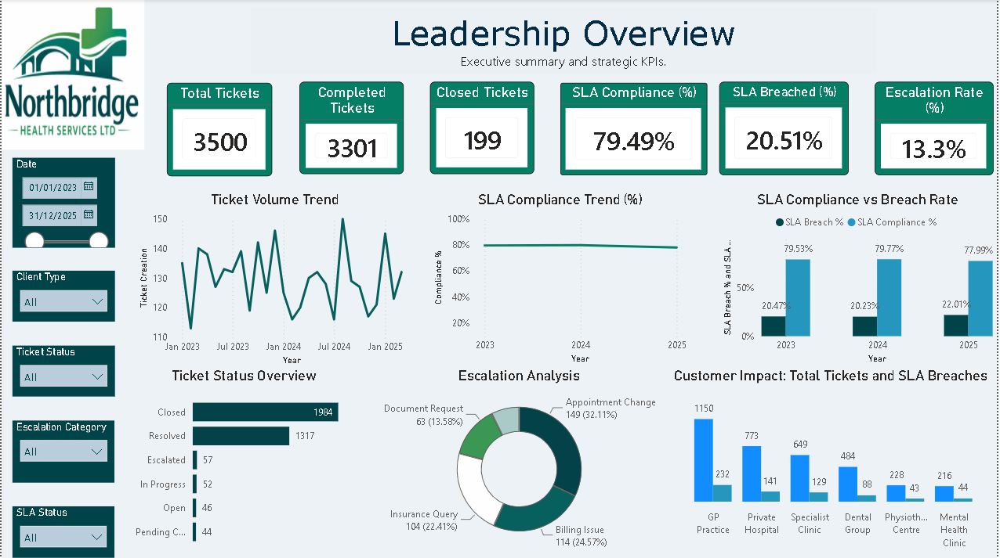
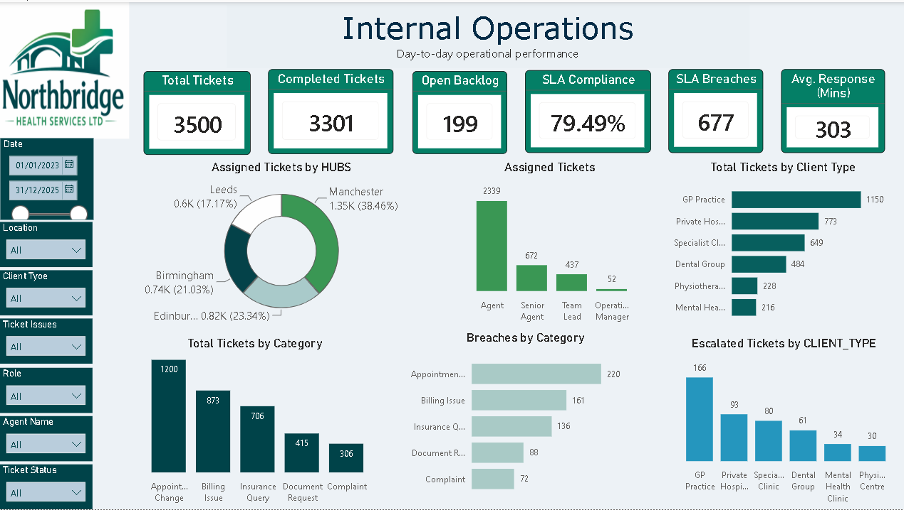
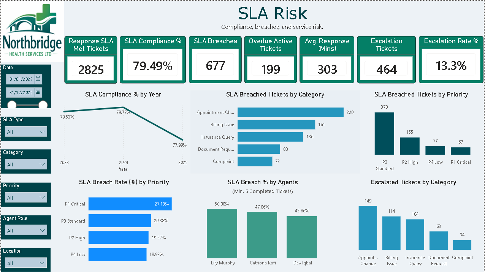
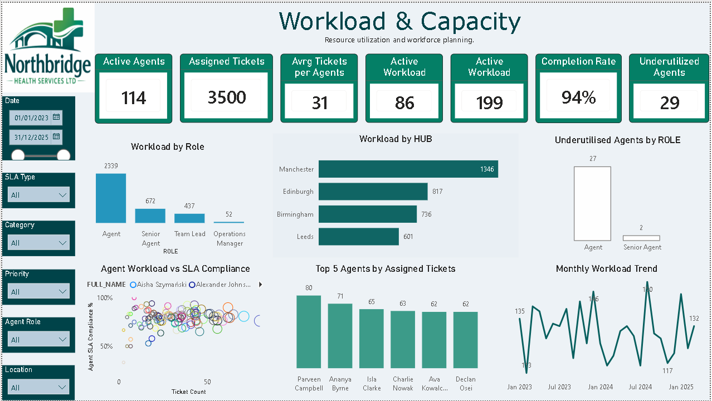

# Customer Support SLA & Operations Analytics | Power BI

An end-to-end Power BI analytics project examining **customer support performance, SLA compliance, escalation risk, operational workload and workforce capacity**.

The solution transforms ticket-level operational data into a four-page management dashboard designed to support both executive oversight and operational decision-making.

---

## Live Interactive Dashboard

Explore the full interactive Power BI report:

**[View the Live Power BI Dashboard](https://app.powerbi.com/view?r=eyJrIjoiY2E2OTk0ZWQtNzE4OC00YWQ2LTljZTgtYWQ2ZDE0NGNhMzBjIiwidCI6ImE4ZmVlMjljLTNmNDktNDdmZC1iOTRiLWM3MzEwNjdhMTkwNiJ9)**

The interactive report includes four management views covering Leadership Overview, Internal Operations, SLA Risk, and Workload & Capacity.


## Dashboard Preview



---

## Project Overview

Customer-support teams need more than ticket counts to understand operational performance. Management needs visibility into whether tickets are being handled within agreed service levels, where breaches are occurring, which customer and ticket segments are driving risk, and whether available workforce capacity is being effectively utilised.

This project was developed to provide a consolidated analytical view of:

**Service Delivery → SLA Performance → Operational Risk → Workforce Capacity**

The dataset represents a historical operational snapshot evaluated as at **4 July 2026**.

---

## Business Objectives

The analysis was designed to:

- Measure overall ticket volumes, completion and active workload.
- Monitor SLA compliance and identify breached tickets.
- Evaluate first-response performance against SLA requirements.
- Identify categories and priority levels associated with SLA risk.
- Analyse escalation patterns across ticket and customer segments.
- Monitor outstanding and overdue workload.
- Assess workload distribution across support agents.
- Identify potentially underutilised workforce capacity.
- Provide management with interactive operational and strategic reporting.

---

## Key Results

| Metric | Result |
|---|---:|
| Total Tickets | 3,500 |
| Completed Tickets | 3,301 |
| Ticket Completion Rate | 94.31% |
| Active Workload | 199 |
| SLA Compliance | 79.49% |
| SLA Breached Tickets | 677 |
| Response SLA Met Tickets | 2,825 |
| Escalated Tickets | 464 |
| Escalation Rate | 13.3% |
| Active Agents | 114 |
| Agents with Active Workload | 86 |
| Underutilised Agents | 29 |

> **Key operational finding:** At the 4 July 2026 reporting snapshot, all **199 tickets within the active workload had passed their SLA deadlines**, highlighting a concentrated backlog-risk area despite an overall ticket completion rate of **94.31%**.

---

# Dashboard Pages

## 1. Leadership Overview

Provides an executive-level view of overall service performance, combining ticket throughput, active workload, SLA performance and escalation indicators.


The page supports high-level monitoring of:

- total and completed ticket volumes;
- active operational workload;
- SLA compliance and breach performance;
- escalation rate;
- monthly ticket trends;
- ticket status;
- customer impact; and
- escalation patterns.

---

## 2. Internal Operations

Provides greater visibility into operational throughput and the distribution of support activity across the organisation.



The page examines performance across:

- operational hubs;
- agent roles;
- client types;
- ticket categories;
- SLA breaches; and
- escalations.

Key operational measures include Total Tickets, Completed Tickets, Active Workload, SLA Compliance, SLA Breaches and Average First Response Time.

---

## 3. SLA Risk

Focuses on identifying service-level risks and areas requiring operational attention.



The page examines:

- response SLA attainment;
- overall SLA compliance;
- SLA breaches;
- overdue active workload;
- average first-response performance;
- escalated tickets;
- escalation rate;
- SLA breaches by category and priority;
- breach rates by priority;
- agent-level SLA performance; and
- escalation patterns.

For agent-level SLA comparisons, agents must have at least **five completed tickets** before being included in the ranking analysis. This reduces distortion from very small ticket samples.

---

## 4. Workload & Capacity

Evaluates workforce capacity, workload distribution and utilisation.



The page examines:

- active workforce;
- assigned-ticket volume;
- average ticket workload;
- agents carrying active workload;
- outstanding operational workload;
- completion performance;
- underutilised agents;
- agent workload versus SLA compliance;
- highest assigned-ticket workloads; and
- monthly workload trends.

Underutilisation is benchmarked using the **first quartile (Q1)** of ticket workload among active agents.

For this dataset, the calculated threshold is **2 tickets**.

---

# Key Findings

### 1. High overall ticket completion

Of **3,500 tickets**, **3,301 were completed**, producing a **94.31% completion rate**.

This indicates strong overall throughput across the reporting period.

### 2. SLA performance presents an improvement opportunity

Overall SLA compliance was **79.49%**, while **677 completed tickets breached SLA requirements**.

This indicates that high ticket completion does not necessarily translate into equivalent SLA performance.

### 3. Outstanding workload represents concentrated SLA risk

There were **199 active tickets** at the 4 July 2026 reporting snapshot.

Validation against individual SLA due timestamps showed that **all 199 active tickets had passed their SLA deadlines**.

This represents a significant operational risk despite the high overall completion rate.

### 4. Escalations represent a material component of service activity

A total of **464 tickets experienced escalation**, equivalent to an **escalation rate of 13.3%**.

Historical escalation was measured using the escalation flag rather than current ticket status because an escalated ticket can subsequently move to another operational status.

### 5. Workforce utilisation is uneven

There were **114 active agents**, while **86 agents had active workload** at the reporting snapshot.

The workload distribution analysis also identified **29 underutilised agents** using the Q1 workload threshold.

### 6. SLA risk varies across priority levels

Priority-level analysis identified meaningful variation in SLA breach rates, allowing management to distinguish between ticket volume and actual breach propensity.

---

# Management Recommendations

### Prioritise overdue active workload

The 199 active tickets were all beyond their SLA deadlines at the reporting snapshot. Backlog recovery should therefore receive focused operational attention.

### Investigate recurring SLA breach drivers

Category- and priority-level analysis should be used to investigate whether breaches are associated with particular request types, complexity levels or operational processes.

### Review escalation drivers

With 464 historically escalated tickets, escalation patterns should be investigated by category and client type to identify opportunities for earlier intervention.

### Review workload allocation

The combination of agents carrying active workloads and agents identified as underutilised provides an opportunity to investigate workload allocation and resource balancing.

### Continue monitoring response performance

First-response performance and response-SLA attainment should be monitored alongside resolution performance so that deterioration can be identified before it contributes to downstream SLA risk.

---

# Data Model

The project uses a **star-schema-oriented Power BI data model**, separating operational fact tables from descriptive dimensions.

## Fact Tables

- `FCT_TICKETS`
- `FCT_ESCALATIONS`
- `FCT_TICKET_AUDIT`

## Dimension Tables

- `DIM_DATE`
- `DIM_AGENTS`
- `DIM_CLIENTS`
- `DIM_PRIORITY`
- `DIM_TICKET_CATEGORY`
- `DIM_SLA`

A dedicated `_Measures` table centralises reusable analytical measures and improves model maintainability.

---

# Selected DAX Measures

## Ticket Count

```DAX
Ticket Count =
DISTINCTCOUNT(FCT_TICKETS[TICKET_ID])
```

## Completed Tickets

```DAX
Completed Tickets =
CALCULATE(
    DISTINCTCOUNT(FCT_TICKETS[TICKET_ID]),
    FCT_TICKETS[SLA STATUS] IN {"Resolved", "Closed"}
)
```

## SLA Compliance %

```DAX
SLA Compliance % =
DIVIDE(
    [SLA Met Tickets],
    [Completed Tickets],
    0
)
```

## Escalation Rate %

```DAX
Escalation Rate % =
DIVIDE(
    [Escalated Tickets],
    [Ticket Count],
    0
)
```

## Ticket Completion Rate %

```DAX
Ticket Completion Rate % =
DIVIDE(
    [Completed Tickets],
    [Ticket Count],
    0
)
```

For the complete KPI logic and DAX definitions, see:

**[KPI Definitions](documentation/KPI-Definitions.md)**

---

# Data Validation & Quality Assurance

The dashboard underwent a structured validation process before publication.

Validation included:

- confirming the ticket-level grain of the primary fact table;
- distinguishing current ticket status from historical escalation events;
- confirming that both `Resolved` and `Closed` represent completed tickets;
- separating SLA targets from actual response and resolution durations;
- validating source SLA indicators against dashboard calculations;
- resolving ambiguous agent relationships;
- validating category and priority filtering;
- reconciling ticket status populations to total ticket volume;
- validating overdue tickets against actual SLA deadline timestamps;
- reviewing report slicers and visual interactions; and
- removing duplicate or misleading calculated measures.

Key reconciliations included:

- **3,301 Completed + 199 Active = 3,500 Total Tickets**
- **2,624 SLA Met + 677 SLA Breached = 3,301 Completed Tickets**
- **79.49% SLA Compliance + 20.51% SLA Breach = 100%**

For unresolved tickets, time-sensitive calculations use the fixed reporting snapshot of **4 July 2026**, rather than the current system date. This ensures historical results remain reproducible.

---

# Tools & Techniques

### Power BI

- Interactive dashboard development
- Star-schema data modelling
- Relationship management
- KPI design
- Visual interaction and filtering
- Operational reporting

### DAX

Techniques used include:

- `CALCULATE`
- `DISTINCTCOUNT`
- `DIVIDE`
- `COALESCE`
- `FILTER`
- `ADDCOLUMNS`
- `CALCULATETABLE`
- `PERCENTILEX.INC`
- context-aware calculations
- snapshot-based calculations

### Analytical Techniques

- SLA compliance analysis
- operational performance analysis
- customer segmentation
- escalation analysis
- workload analysis
- workforce capacity analysis
- percentile-based utilisation benchmarking
- data validation and reconciliation

---

# Project Documentation

Detailed project documentation is available within this repository:

- **[Data Dictionary](documentation/Data-Dictionary.md)** — source fields, table definitions, SLA policies, ticket statuses and business terminology.
- **[KPI Definitions & DAX](documentation/KPI-Definitions.md)** — business definitions, DAX measures, validation results and calculation rules.

---

# Repository Structure

```text
Customer-Support-SLA-Operations-Analytics/
│
├── README.md
│
├── documentation/
│   ├── Data-Dictionary.md
│   └── KPI-Definitions.md
│
└── images/
    ├── 01-Leadership-Overview.png
    ├── 02-Internal-Operations.png
    ├── 03-SLA-Risk.png
    └── 04-Workload-Capacity.png
```

---

# Skills Demonstrated

**Power BI | DAX | Data Modelling | Data Validation | KPI Design | SLA Analysis | Operational Analytics | Workforce Analytics | Business Intelligence | Data Visualisation | Business Insight & Recommendations**

---

# Author

**Ndubuisi Anozie**  
Business & Data Analyst

[LinkedIn](https://www.linkedin.com/in/ndubuisi-anozie)

---

*This project was developed as a portfolio demonstration of Power BI, data modelling, operational analytics and business intelligence capabilities.*
